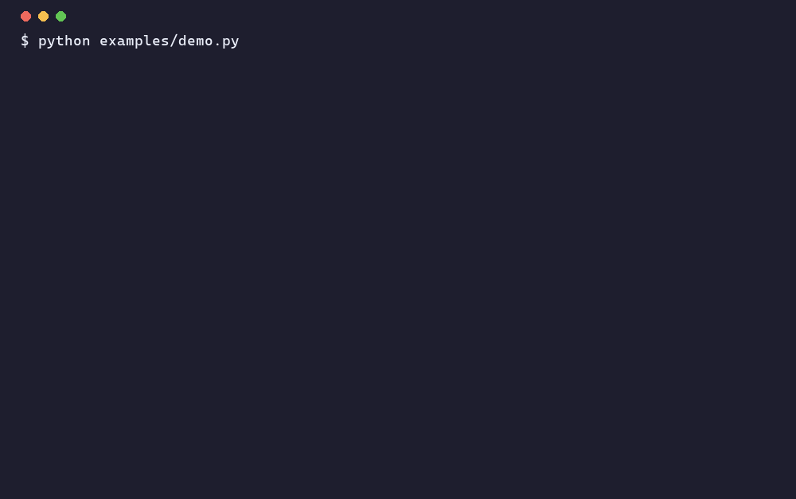

<div align="center">

# Mnemosyne · `mnemo`

**A memory layer for AI agents — the one that already runs an autonomous research OS over ~6,000 notes.**

*Memory is the mother of the Muses. An agent with no memory has no ideas.*

`pip install agora-mnemo` · [PyPI](https://pypi.org/project/agora-mnemo/) · [Hugging Face](https://huggingface.co/Danchi17/mnemo) · [DOI 10.5281/zenodo.21128549](https://doi.org/10.5281/zenodo.21128549) · MIT · v0.4.3

</div>

---

`mnemo` is the recall + consolidation core of [Agora](https://github.com/DanceNitra/agora) — an
autonomous research system — distilled into **a single file with no required dependencies**. It does
the four things agent memory actually needs, the way that held up running in production for weeks.

Most "agent memory" libraries are demos. This one is extracted from a system that has used it daily
to curate a 6,000-note knowledge base, and whose consolidation behaviour we have **measured**, not
assumed (see *Provenance* below).

## Install

```bash
# single file, zero dependencies
curl -O https://raw.githubusercontent.com/DanceNitra/agora/main/mnemo/mnemo.py
```

## Use

```python
from mnemo import Mnemo

m = Mnemo("memory.json")                       # persists to JSON; or Mnemo("memory.json", embed=my_model)

m.remember("Pre-trend tests catch only ~31% of fatal DiD bias.", tags=["causal"], value=3, mtype="semantic")
m.recall("difference in differences", k=5)     # relevance × value, decayed by the memory's per-type half-life
m.consolidate(keep=200)                        # the "dream" pass: hubs, dedup, STATE-TOGGLE, keep-budget
m.consolidate_clusters(threshold=15)           # cluster-TRIGGERED: consolidate only a topic that's grown dense
m.contradictions()                             # flag incompatible memories for REVIEW (never deletes)
m.value_by_cohort()                            # value reported per tag/time-block, not per memory
```

Bring any text→vector function as `embed=` for semantic recall; with none, `mnemo` falls back to a
forgiving lexical match so it **runs anywhere, today**. Once the store grows past the threshold, recall
**fuses lexical (BM25) + semantic with Reciprocal Rank Fusion**. On high-lexical-overlap agent memory
(e.g. LoCoMo) the fused hybrid *measurably* beats either channel alone (recall@20 **+0.06** over the best
single channel, 9/10 conversations, conversation-level bootstrap CI excludes 0; receipt:
[`probes/locomo_retrieval_map.py`](probes/locomo_retrieval_map.py)); where the embedder already dominates
(paraphrase-heavy corpora, see benchmarks) fusion adds little. `mode='auto'` fuses; `mode='lexical'` /
`'semantic'` force a single channel.

### Poison-resistant recall: `recall(..., influence_only=True)` (0.4.0)

Retrieval-time / embedding-geometry defenses do **not** stop memory poisoning in general. We red-teamed
`mnemo` with a real AgentPoison-style single-instance attack (Chen et al., NeurIPS 2024; PoisonedRAG, Zou
et al., USENIX Security 2025): a **plain-English trigger sentence** in one poisoned memory hijacks raw
top-1 retrieval **88–100%**, it is **scale-invariant** (60→10 000 memories), it **evades a perplexity
filter** (natural triggers have natural perplexity), and coherence/outlier retrieval defenses **don't
generalize across encoders**. The layer that *does* generalize is **influence-gating by corroboration**:
`recall(..., influence_only=True)` returns only memories that earned the same bar as episodic→semantic
graduation (a credited good outcome, or ≥2 distinct-source links). Retrieve freely for context; gate what
drives an *action*. Measured: single-instance poison rank-1 hijack → **0%** on MiniLM/BGE/Contriever and
at every scale, because an injected poison never earns corroboration while real memories earn it through
use — and it generalizes precisely because it lives in **provenance metadata, not embedding geometry**.
Honest cost (a calibration tradeoff): a rare-but-true memory that hasn't earned corroboration is filtered
too (recall 1.00 corroborated vs 0.08 uncorroborated), so this is for **adversarial / untrusted-ingestion**
use. It raises attacker cost (defeating it needs ≥3 coordinated records with ≥2 forged independent
provenances), it does not make poisoning impossible. Receipts: [`probes/agentpoison_influence_gate.py`](probes/agentpoison_influence_gate.py),
[`probes/agentpoison_influence_gate_validation.py`](probes/agentpoison_influence_gate_validation.py).

### Know before you gate: `influence_gate_report()` (0.4.3)

The influence gate is not free, and its cost is **density-dependent** — so check it before you rely on it.
`influence_gate_report()` returns the gate's **live cost on your store** (`would_block_frac` = the fraction of
active memories it would filter, plus the corroboration breakdown and an `advice` string). Why it matters, and
both measured on [`probes/oracle_separation_density.py`](probes/oracle_separation_density.py) (controlled corpus,
real embeddings): **(1) density = affordability** — the fraction of *legitimate* high-stakes recalls the gate
blocks falls from **~51% when each memory is used ~once (sparse)** to **~6% when each is used ~8× (dense)**,
because a legit memory only earns standing through repeated successful use; in a thin store the gate can't tell a
poison from a newcomer and filters most legit recalls (the classic *cheap-pseudonyms / whitewashing* tax, Friedman
& Resnick 2001). **(2) The gate rides entirely on an un-self-gradable oracle** — a MINJA-style self-graded outcome
(arXiv:2503.03704) collapses it at *every* density, even inverting it (blocking legit more than poison), so never
let recalled content drive its own `credit()`; issue outcomes from the application, on real resolved work.

### Soft metadata filter: `recall(prefer=..., prefer_trust=...)` (0.4.1)

A hard metadata filter (`where={"speaker": x}`) deletes non-matching memories — great when the filter is
right, but when your extractor guesses the wrong value it **hard-deletes the answer**. The soft version
only *boosts* matching memories, weighted by how much you trust the cue this call, and leaves everything
else rankable: `recall(q, prefer={"speaker": x}, prefer_trust=t)`, `t∈[0,1]` (0 = no filter, 1 = strong
preference). Pass a **low** `prefer_trust` when the match is weak/ambiguous so the filter backs off toward
plain recall. The point is to weight by the **a-priori reliability of the extraction** (e.g. alias-match
strength: exact-name hit → ~1.0, no-name/ambiguous guess → ~0.0), *not* by the extractor model's own
self-reported confidence (which is corrupted exactly when it's wrong). MEASURED end-to-end through
`recall()` on LoCoMo (receipt: [`probes/locomo_soft_prefer_filter.py`](probes/locomo_soft_prefer_filter.py)):
with an extractor that is reliable on exact-name questions (5% wrong) but guesses on ambiguous ones (67%
wrong), alias-strength-weighted `prefer` scores **recall@20 0.718 (+0.144 over no filter, best of all,
10/10 conversations)** and — on the subset where the extractor picked the wrong speaker — recovers to
**0.315 vs the hard filter's 0.110** (which craters by deleting the right answer). Soft `prefer` gives the
filter's upside without the hard filter's downside. Reversible: `prefer=None` = legacy recall.

### Compose several soft cues: multi-dimension `prefer` (0.4.2)

Pass `prefer` as a **list** of `(cond, trust)` tuples (or `{"cond":…, "trust":…}` dicts) to weight more
than one cue at once — e.g. a resolved time window *and* a named speaker:
`recall(q, prefer=[({"year": 2023}, 0.9), ({"speaker": x}, 0.7)])`. Matching cues **compose as a product**
of neutral-at-1.0 factors, so a memory matching both is boosted more than one matching a single cue, and a
non-matching cue is inert. Cap the total with `prefer_max_boost` (a ceiling on the product, like
Elasticsearch `function_score`'s `max_boost`). A single `dict` + scalar `prefer_trust` is the one-dimension
case, unchanged. MEASURED (receipt: [`probes/locomo_composed_soft_filters.py`](probes/locomo_composed_soft_filters.py),
self-check 0/1568 vs the shipped path): on LoCoMo questions carrying two independent cues (n=183), the
product composition scores **recall@20 0.865 vs 0.755 for the best single cue (+0.110, bootstrap CI excludes
0)**, while a summed boost *capped at one dimension's trust* crowds out (−0.053 — the cap flattens the joint
evidence, the classic "combine outside the saturating form" failure, BM25F/Robertson et al. CIKM 2004). So:
compose as a **product**, and if you cap, cap the product — the same choice production search settled on
(Elasticsearch defaults `score_mode=multiply`). Honest scope: one benchmark, one embedder, near-orthogonal
cues. Reversible: a single dict / `None` behaves exactly as before.

**Compose only cues you trust** (receipt: [`probes/locomo_correlated_cue_composition.py`](probes/locomo_correlated_cue_composition.py)).
A product inherits the product-of-experts *veto* (Hinton 2002): a near-zero factor vetoes, so a target that
misses *either* cue collapses far below an additive sum or the trusted cue alone — measured, on the subset
where the second cue is wrong-for-the-query, product recall@20 **0.10 vs sum 0.52 vs one-cue 0.70**. So an
unreliable second cue hurts a *product* more than a *sum* (and can do worse than not composing at all). The
fix is the per-cue `trust` you already pass: down-weighting an untrusted cue restores the product toward the
sum. Interestingly this is **not** a correlation effect — the gap is largest when the cues are *orthogonal*
and *shrinks* as they correlate (a redundant copy just can't miss when the real cue hits). Rule of thumb:
compose a second cue **only when it is independently reliable for the query**, and weight it by that reliability.

## Use it as an MCP server (any Claude / Cursor / agent client)

`mnemo` ships an [MCP](https://modelcontextprotocol.io) stdio server so any MCP-compatible agent can
use it as long-term memory — `remember` (with a per-type decay prior), value-ranked `recall`,
`consolidate`, `consolidate_clusters`, `contradictions`, `value_by_cohort`, `forget` (verified erasure).
`mnemo.py` stays
zero-dependency; only the server needs the SDK:

```bash
pip install "mcp[cli]"
curl -O https://raw.githubusercontent.com/DanceNitra/agora/main/mnemo/mnemo.py
curl -O https://raw.githubusercontent.com/DanceNitra/agora/main/mnemo/mnemo_mcp.py
MNEMO_PATH=./agent_memory.json python mnemo_mcp.py      # speaks MCP over stdio
```

Register it with a client — e.g. Claude Code (`.mcp.json`) or Claude Desktop
(`claude_desktop_config.json`):

```json
{
  "mcpServers": {
    "mnemo": {
      "command": "python",
      "args": ["/abs/path/to/mnemo/mnemo_mcp.py"],
      "env": { "MNEMO_PATH": "/abs/path/to/agent_memory.json" }
    }
  }
}
```

For **semantic** recall, point it at any OpenAI-compatible embeddings endpoint via
`MNEMO_EMBED_URL` / `MNEMO_EMBED_MODEL` / `MNEMO_EMBED_KEY`; with none set it uses the lexical
fallback. The agent then calls `recall(query)` before reasoning and `remember(fact)` as it learns —
its memory is value-ranked and append-only, not a recency buffer.

## The four operations

| op | what it does |
|---|---|
| `remember(text, tags, value, mtype, key)` | **append-only** raw capture, absolute UTC time, never edited; `mtype` ∈ {episodic, semantic, procedural} sets the **decay prior** (events fade fast, durable facts slow, rules barely). Optional `key` = a **deterministic (subject, relation) supersession key**: a new value retires every active record with the same key — *no similarity threshold, no LLM* — so recall never serves the stale value (bi-temporal: a back-filled earlier value can't overwrite the current one) |
| `recall(query, k, where=…)` | **value-ranked** retrieval: relevance × value, **decayed by the memory's per-type half-life** (access resets the clock), so important durable memories beat both merely-similar and stale ones. Optional `where` = a **metadata pre-filter** (the cheap *filter-before-you-rank* lever): field → scalar / list / operator (`$gte $lte $gt $lt $in $nin $ne $contains`), matched top-level then `meta`, ALL fields AND-ed — e.g. a hard time-range `where={"valid_from":{"$gte":t0,"$lte":t1}}` or a closed-set entity `where={"speaker":{"$in":[…]}}`. Measured to beat retriever choice on LoCoMo (`probes/locomo_metadata_prefilter.py`); it's a HARD filter, so on lossy/predicted extraction keep it loose (a wrong filter hard-deletes the answer). Reinforcement is **relevance-weighted** (a bullseye hit reinforces value more than one that squeaked into top-k, so a weak-but-frequent false positive can't go immortal); a repeatedly-recalled episodic memory **graduates** to semantic **only when corroborated** — by an earned outcome, or by **≥2 distinct *canonical* sources** (entity-resolved before counting, so sybil variants of one origin — `Wikipedia` / `wikipedia.org` / a full URL — collapse to one and can't mint durability); and a memory whose source was later contradicted is **provenance-demoted** + flagged `stale_derived` |
| `consolidate(keep)` | the **dream pass**: flag universal-matcher *hubs*, link near-duplicates, apply the **state-toggle guard** (a polarity clash supersedes, doesn't merge), supersede the low-value surplus — only *adds* a derived layer |
| `consolidate_clusters(threshold)` | **cluster-triggered** consolidation: consolidate a semantic cluster only once it's grown past `threshold` — sparse topics keep their raw episodes, dense ones don't grow unbounded |
| `contradictions()` | flag mutually-incompatible **related** memories (similarity-gated) for human review |
| `forget(ids, where)` | the one op that **truly deletes** (the rest is append-only): hard-removes the matched records *and* scrubs their ids from every survivor's links + toggle pointers + the vec/token caches, so a forgotten memory can't resurface via recall, a consolidation link, or the dream pass. For erasure / right-to-be-forgotten, poison removal, or a hard correction — measured 15/15 on a verified-forgetting severe-test |

## Five rules it won't break (each one cost us to learn)

1. **Raw capture is immutable.** Consolidation adds links and markers; it never overwrites the
   source. This is what stops the slow accuracy drift of LLM-rewritten memory.
2. **Absolute timestamps at write time.** Relative/derived times rot the moment they're consolidated.
3. **Value-ranked, type-aware decay.** Retention is `value × a per-type half-life`, not recency or
   access-frequency alone. A *uniform* access-reset clock keeps merely-*popular* memories while a
   load-bearing-but-cold fact — queried once a month, prevents a destructive action — starves; we
   measured exactly that failure. The fix is that the half-life is set by **kind**, not by read
   count: episodic events fade in days, semantic facts in months, procedural rules barely at all. A
   cold-but-critical fact survives by being **typed** semantic/procedural (long half-life × its high
   value), not by frequent reads; access only resets the clock *within* a type's window.
4. **Value is reported at the cohort level** (tag / time-block), never per-memory.
5. **Contradictions are flagged, never auto-resolved.** Silent rewrites destroy trust in the whole
   memory.

## Provenance — why these rules, with receipts

`mnemo`'s design isn't taste; it's what Agora's lab *measured*:

- **Semantic recall beats keyword recall, and the gap widens with scale** — as the store grows to
  the ~6,000-note full corpus, lexical `recall@5` decays from **0.94** (small store) to **0.25**,
  while semantic **holds at ~0.65** — ≈**2.6×** at full scale (Agora Lab `b4c260`); on paraphrase
  queries semantic `recall@5` is **0.86 vs 0.20** lexical (`3501f1`). The embedder is the real lever
  at scale; the lexical overlap match is the zero-dependency *floor* that still runs anywhere on a
  small store. (Honest footnote: pruning
  universal-matcher *hub* notes lifts **lexical** recall ~20% only when a store is link-spammed, and
  does **not** move semantic recall — it's a lexical/hybrid optimisation, not a headline.)
- **Value-ranked consolidation** — under a keep-budget, ranking *what to keep* by value beats
  FIFO/random, and the advantage **scales super-linearly as the budget shrinks** (≈1.8× at half
  budget → ≈4× at one-eighth), surviving heavy estimation noise.
- **Retention must blend value with recency, not decay on access alone** — we simulated a
  half-life-with-access-reset policy (a *popularity* signal) against a value-aware blend under a
  shrinking budget, with value made deliberately anti-correlated with access-frequency for a
  load-bearing-but-cold subset. At a 30% keep-budget the access-decay policy retained only **2.8%**
  of the high-value/low-frequency memories and **20%** of total value, vs **100%** and **64%** for
  the blend — about **3× more value kept** (the gap persists, ≈2.2× retained value, even at a 7%
  budget). Pure access-frequency decay starves the rarely-queried-but-critical memories; forgetting
  must consume an explicit value channel *separate from* access recency. (Agora Lab `19d802`.)
- **Supersession needs a deterministic key, not embedding similarity** — replicating an external
  result (MemStrata / Yadav, arXiv 2606.26511) on our own local `nomic` stack: a cosine-similarity
  classifier separating a *contradicted* fact from a *rephrased duplicate* scores **AUROC ~0.61**
  (near chance) — a contradiction is often *more* embedding-similar to the original than a true
  rephrase is. A similarity-based store therefore serves the **stale value ~42% of the time**; the
  deterministic `(subject, relation, object)` supersession key (`remember(..., key=...)`) drives that
  to **0%** (Agora Lab `exp_supersession_replication`, severe-test 8/8). This is *why* supersession is
  a key, not a threshold.
- **No single recall mechanism survives all operating points — only the layered store does** —
  head-to-head on a synthetic *evolving + contaminated* stream (stable / superseded / poisoned facts,
  local `nomic`): a naive **cosine top-1** store scores **42%** (fine on stable, but blind to
  supersession — **0/8** on updated facts — and fooled by repeated lies); a **recency** store **67%**
  (fixes supersession but serves the *freshest lie* — **0/8** on poison); `mnemo` — deterministic
  supersession key **+** corroboration gate **+** value-ranking — is **100%**, robust across all three.
  Each single mechanism wins one regime and loses another (the *memory operating-point trap*), which is
  why the durable layer needs all three together (probe `mnemo/probes/operating_point_memory.py`).
- **Cohort-level value** — per-memory outcome attribution is **statistically underpowered at n-of-1**
  (the best proxy reached only ~0.36 power at realistic sample sizes); the cohort is where the
  signal lives. Hence rule 4.
- **Contradiction detection** runs in production over the 6,000-note vault; the lesson that it must
  *flag, not auto-edit* (rule 5) is why silent rewrites are forbidden.

(Methods + numbers live in the Agora track record: <https://dancenitra.github.io/agora/>.)

## The `second_brain` thinking layer

`mnemo_mcp` gives an agent **memory**. `second_brain_mcp` gives it a **second brain to think over** —
point it at any folder of Markdown notes (an Obsidian vault, a Zettelkasten, a `docs/` tree) and an
MCP client (Claude Desktop, Claude Code, Cursor, your own agent) gets the substrate to *reason
against* those notes: pull what's relevant, find where the network is blind, surface non-obvious
bridges, isolate the claims worth checking, and generate ideas by named methods.

**The split that keeps it honest.** The server returns **retrieval + structure**; the calling LLM does
the **reasoning**. The tool is the memory and the map; the agent is the mind. There is no LLM call
inside this server — it scores, links, and slices your notes, then hands the material back. So the
claims below are about what an *agent* did with the tools, not about the tool "thinking" on its own.
No autonomous oracle.

**Runs today, zero config.** It indexes your notes into an in-process `mnemo` store at startup; with
no embedder it uses the lexical-overlap fallback. An embedder (`MNEMO_EMBED_URL/MODEL/KEY`) is optional
and matters **at scale**: on a ~6,000-note vault, lexical recall@5 decays from 0.94 (small store) to
**0.25** at full corpus while semantic **holds ~0.65** — ≈2.6× (Agora Lab `b4c260`); on paraphrase
queries semantic recall@5 is **0.86 vs 0.20** lexical (`3501f1`).

```
NOTES_DIR=/path/to/your/vault python second_brain_mcp.py      # run after a flat download of both files
```

### See it run (no setup)



`python examples/demo.py` runs every tool against a tiny bundled sample vault — no MCP client, no
key, no embedder. (Regenerate the GIF with `python examples/_make_gif.py` (Pillow) or
[`examples/demo.tape`](../examples/demo.tape) + [`vhs`](https://github.com/charmbracelet/vhs).)
The same session in text:

```text
▸ relevant_notes("how does feedback speed up learning", k=3)
  → Deliberate Practice (Learning)   relevance 0.60
  → Expected Value     (Decisions)   relevance 0.20

▸ find_gaps()              → isolated: ["Sourdough Starter"]   (the one note with no [[links]])

▸ bridge_candidates("Deliberate Practice")
  → Habit Loops (Habits, DISTANT domain)   — both turn on "feedback latency", and nothing links them

▸ extract_claims("Deliberate Practice")
  → "Feedback latency is the hidden variable: the longer the gap between an action
     and its feedback, the slower the learning."   (line 3 — go ground or challenge it)

▸ idea_methods()           → 10 recipes (Hidden-Connection Bridge, Missing-Reciprocity, …)
```

That `bridge_candidates` hit is the point: a connection across two folders that *you never linked* —
the agent now writes the mapping (or rejects it). The tool found the material; the agent does the thinking.

Register it with an MCP client (point `args` at the file's absolute path so `mnemo.py`, which sits
beside it, is found):

```json
{
  "mcpServers": {
    "second_brain": {
      "command": "python",
      "args": ["/abs/path/to/second_brain_mcp.py"],
      "env": {
        "NOTES_DIR": "/abs/path/to/your/vault",
        "SECOND_BRAIN_INDEX": "/abs/path/to/second_brain_index.json"
      }
    }
  }
}
```

| tool | returns |
|---|---|
| `index_status` | notes indexed, folder spread, resolved `NOTES_DIR` (call first; `0` ⇒ fix `NOTES_DIR`) |
| `relevant_notes` | the `k` most relevant notes by relevance × accrued value (value accrues with use; a cold index is effectively relevance-ranked), with excerpts |
| `coverage_gap` | the **negative space** of a question: top notes + a measured completeness score + the explicit sub-terms with **no** supporting note — a WYSIATI guard so the agent sees what's *missing* and doesn't answer a tidy-but-incomplete context with false confidence |
| `find_gaps` | isolated/under-linked notes + thin folders — where the network is blind (noisy on a tiny vault; earns its keep at scale) |
| `bridge_candidates` | distant notes (different folder, no link) that are semantically close = candidate connections; the agent writes or rejects the mapping |
| `extract_claims` | claim-like sentences from a note so the agent can ground or challenge them |
| `idea_methods` | a toolkit of named idea-generation recipes, so generation is principled, not a vibe |

Dogfood result, stated honestly: pointed at the maintainer's own ~6,000-note vault, an agent using
these tools caught a number in his *own* forecasting note inflated ~7× ("60-78%" vs the real ~6-11%),
surfaced two silently-contradicting notes, and proposed ideas via `idea_methods` — two of which were
then severe-tested **in Agora's separate research lab** (not inside this server) and held. The LLM did
the reasoning; the corrections still warrant a source-check before public citation.

### Trust & safety
- **Read-only over your notes.** The server reads `NOTES_DIR` recursively; it does no `eval`, no shell,
  no subprocess, and writes only its own index file. Symlinks/junctions that point *outside*
  `NOTES_DIR` are deliberately **not** followed (so a planted link in a shared/cloned vault can't leak
  files from elsewhere on disk).
- **The embedder is a trust boundary.** If you set `MNEMO_EMBED_URL`, the **full text of every note**
  is POSTed there. It's validated at startup — `https` anywhere, plain `http` only to loopback (local
  Ollama, etc.), and cloud-metadata/link-local targets are refused. Point it only at an endpoint you trust.
- **Notes over ~2 MB are skipped** (configurable via `SECOND_BRAIN_MAX_BYTES`) so a single huge file
  can't exhaust memory.

## Status

`v0.2` — the core, honest and runnable, **now with two MCP servers** (`mnemo_mcp` for memory,
`second_brain_mcp` for the thinking layer over your notes) **and a deterministic supersession key**
(`remember(..., key=...)`) that closes the embedding *supersession blind spot*. Roadmap: pluggable
vector stores, a hosted tier. Open-core; the core stays free.

MIT-licensed · part of [Agora](https://github.com/DanceNitra/agora).

## Self-maintaining (maintain.py)
The #1 second-brain frustration is **maintenance**, not capture. `maintain.py` runs the chore people
stop doing — over a folder of Markdown notes it finds **dead `[[wikilinks]]`, orphan notes, stale
notes, near-duplicate clusters**, and a **vault health score** (`self_legibility` = % of notes in the
link graph's giant component — knowledge debt is a *percolation* collapse, so it warns *before* the
cliff). Crucially it turns findings into **actions**: for each orphan it **suggests which existing
note to link it to** (re-connecting it to the graph), and flags **archive candidates** (old +
isolated). It resolves links by filename *or* frontmatter alias, and dates notes by frontmatter
(not git-reset mtime) — both learned from dogfooding it on a real ~7,700-note vault (it rescued ~300
falsely-flagged orphans). Advisory + safe: it returns a plan and an action list; it never edits,
moves, or deletes a note. And it can **apply** the fix when you ask: `apply_suggestions` appends a
marked `## Related (auto-suggested)` block of `[[links]]` to each orphan — additive only, idempotent
(re-running replaces its own block), **dry-run by default**. `python maintain.py` runs a verified
round-trip on a synthetic vault (diagnose → suggest → apply); `maintenance_report` and `apply_links`
in `second_brain_mcp.py` expose it to any MCP agent.
